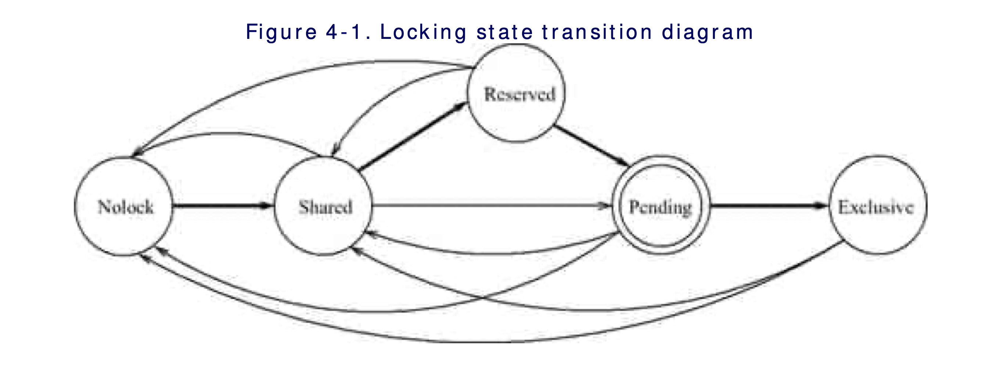
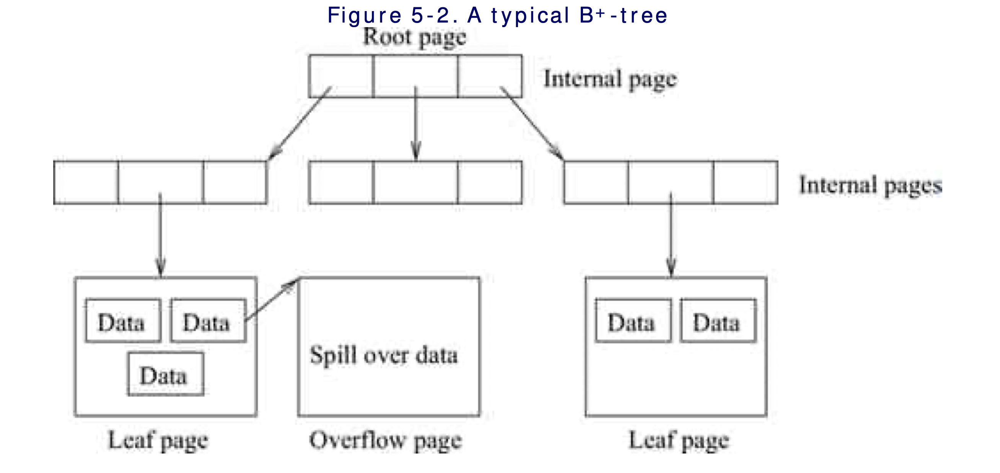
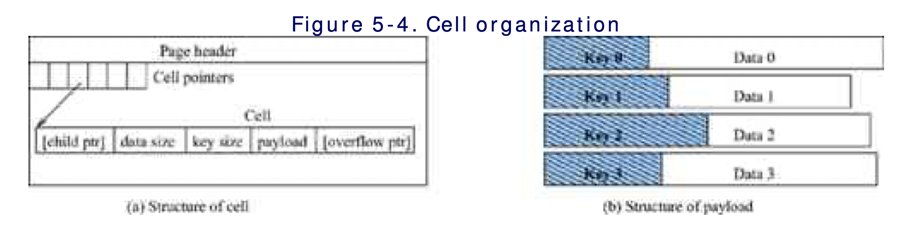
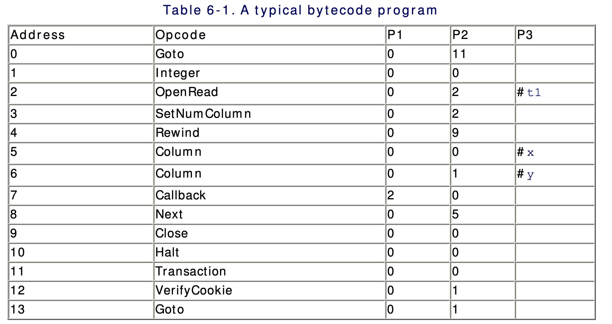
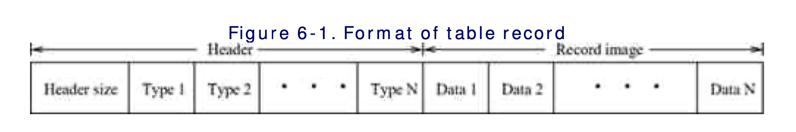
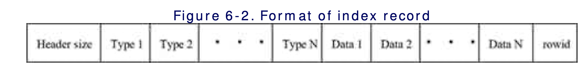
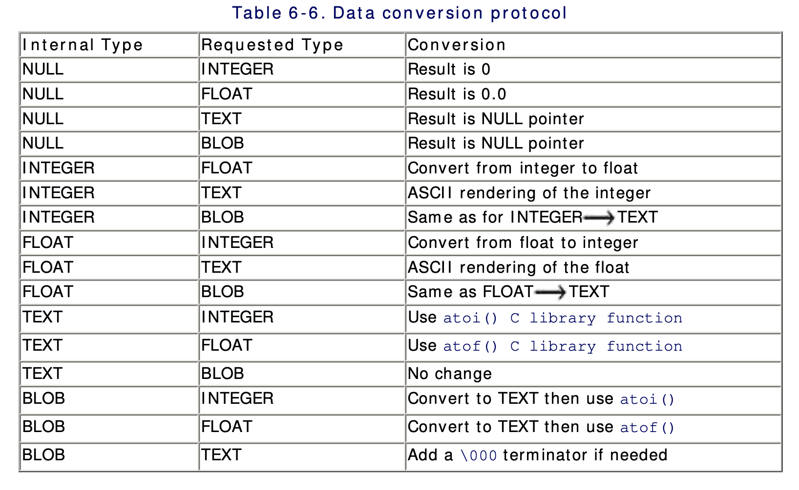
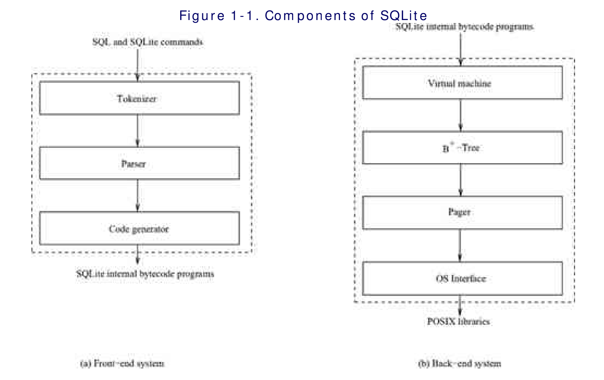
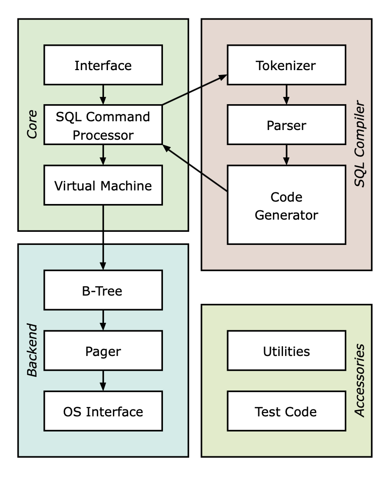

[TOC]

## 1. 综述

SQLite的特性：

- 0配置，相关的配置更改可在编译阶段完成
- 所需的库已植入在应用中
- 支持事务
- 线程安全，SQLite仅支持数据库级别的线程并发
- 轻量级
- 可定制
- 跨平台

SQLite的设计目标是简单化，因此会在性能上做妥协。SQLite把整个数据库存储在一个原始的本地文件上 ，同时用另一个单独的日志文件存储事务信息。它可同时支持任意多个读事务，但只支持一个写事务。

### 1.1 SQLite的关键函数

#### sqlite3_open

应用程序通过此函数创建一个数据库连接，它打开或创建一个数据库文件，实际的读或创建文件操作实在文件可接触到时才执行。

#### sqlite3_prepare

此函数编译一个SQL声明，并产生一个内部对象，此对象是一个运行在在虚拟机上的字节码程序。

此函数返回一个`statement handle`（指向`sqlite3_stmt`类型对象的指针），此对象用于执行进一步的操作，同时返回一个游标用于获取sql执行的结果。

#### sqlite3_step

执行字节码程序，直到它遇到一个断点（获取到下一行）或者执行完毕（返回`SQLITE_DONE`）。每次执行此函数，它都将游标指向结果集的下一行。

#### sqlite3_column_int

在存储类型和语言类型之间转换数据。

#### sqlite3_finalize

释放本次sql执行过程中分配的资源。

#### sqlite3_close

关闭数据库连接，释放分配到连接到所有资源。

#### sqlite3_bind

将参数值分配到SQL中的参数位置上

#### sqlite3_reset

遇到异常，重置`statement handle`到初始状态。

### 1.2 系统表

`catalog`由SQLite自行维护，它存储了数据库的元信息，用户只能查询这些元信而不能自行修改。这些元信息存储在以`sqlite_`前缀为表名的表中。

### 1.3 架构

#### 前端

实现`sqlite3_prepare`函数。

- tokenizer:用于识别输入端SQL标签
- parser: 分析SQL语句的结果，产生语法分析树，同时对SQL的结构进行优化
- code generator: 遍历语法树，产生字节码。

#### 后端

实现`sqlite3_bind_*`,`slqte3_step`,`sqlite3_column_*`,`sqlite3_reset`,`sqlite3_finalize`函数。

- 虚拟机：内部字节码程序的解释器，它是最终字节码程序的执行者。
- B/B+树：分别把索引和数据组织到B树和B+树当中。
- pager: 创造一个面向页的数据库文件抽象，它管理内存块以便B/B+树某款使用，另外，它还管理文件管理和日志以实现事务特性。
- 操作系统接口：针对不同的操作系统向数据库提供统一的接口。

## 2. 数据库文件格式

### 2.1 命名规则

当应用需要打开一个数据库时，它调用`sqlite3_open`，传入数据库文件名。当数据库文件名为以下两种情况时情况有所不同：

- 文件名是C语言的空指针（0），SQLite打开一个新的临时文件；
- 文件名是`:memory:`，SQLite创建一个内存数据库。

以上两种情况，都不能持久化数据库。

临时文件名是`sqlite_+16位随机字母数字`，并依次尝试在以下目录中存储：`/var/tmp`，`/usr/tmp`，`/tmp`，`pwd`。

`In either of the above-mentioned ways of opening database (file, temporary database, or in-memory database), the database opened by SQLite is internally named as the main database.`

SQLite为每个数据库连接创建一个临时数据库（名为`temp database`）。临时数据库中存储临时对象例如表和索引。应用可通过`main`和`temp`来指定使用哪个数据库，临时数据库的目录名为`sqlite_temp_master`。临时数据库仅在同一个连接中可见，当连接关闭时，临时文件即被删除。

### 2.2 数据库文件结构

SQLite用一个文件存储整个数据库，为了简化数据读写和空间管理，SQLite使用`page（页）`这一概念，它将数据库文件分割成固定大小的区域（即页）。页大小介于0.5MB和32MB之间（若不考虑操作系统的限制），其默认值为1MB（为描述方便，以下若不声明单位则默认为字节）。数据库文件由一系列页组成，其编号从`1`开始，最大可达到`2^31-1`（即页编号存储在4bytes磁盘空间中）。

> 创建数据库文件时，SQLite默认使用编译时指定的页大小，页大小同样可以在创建数据库中第一张表时指定。

### 2.3 页的类型

SQLite系统中存在四种类型的页：`叶子页`，`内部页`，`溢出页`，`空闲页`，即根据数据库的实现需要，在B/B+树的基础上扩展出溢出结点和空闲节点。

SQLite使用B+树来组织数据，其中叶子结点用来存储表中实际的数据，如果表中一行数据太大，则将超出可用空间的数据存储在溢出结点中。

### 2.4 文件头

SQLite可以给任何页分配任意类型，但`编号1`的页的类型为`内部页`，这一页中包含一条100bytes的文件头记录，这条记录描述了数据库文件的信息，此信息在创建数据库文件时即被写入。文件头的格式及各部分的含义请参考[官方文档-数据库文件格式-1.3数据库头信息](https://www.sqlite.org/fileformat2.html)。

以下仅描述空闲页列表管理机制：

- 空闲页分为主干页和叶子页
- 文件头中第`32-40`页描述空闲页相关信息：第`32-36`字节存储空闲链表中第一个`主干页`的地址，第`36-40`字节存储空闲页的数量。
- 主干页中存储的内容分为三部分：4字节空间存储链表上下一主干页的页编号、4字节空间存储依附于当前主干页的叶子页数量、4n（n >= 0）字节依次存储叶子页的页编号。
- 页被释放时，SQLite将它加入到空闲页链表备用，而不是释放到文件系统中。分配新页时直接从空闲链表中取下一页即可，若空闲链表为空，才从本地文件系统中获取新页并添加到数据库文件。

> `vacuum`操作可清除空闲页链表，SQLite执行此操作时将数据库复制到一个临时文件，然后从临时文件写回到数据库文件。当然，全套操作在一个事务内完成。

### 2.5 `page 1`中剩余部分

除了存储文件头之外，`page 1`还存储了一个B+树的内部结点，此结点是整个B+树的根结点，命名为`sqlte_master`或`sqlite_temp_master`。

> 注意：所有整型值都以大端存储，以避免跨平台移动数据库文件时出错。

## 3. 页缓存管理

SQLite通过`pager`模块实现缓存管理，也只有这个模块能访问本地数据库文件和日志文件。它仅操作文件头中的一些字段，例如文件修改计数位。

`pager`进行随机存取的文件操作，它将面向字节的文件系统操作抽象成`页`的操作，使其它模块独立于文件系统。例如B+树只通过`pager`接口访问数据库文件或日志文件，它将这些文件看作大小一致的页数组。

### 3.1 功能

基本功能：在文件系统和内存之间传输`page`。`pager`利用较小的内存，使其它模块可通过页编号在内存中访问页内容。

`pager`再利用以下功能实现了事务处理：事务管理、数据管理、日志管理、锁管理。

- 事务管理器：通过控制并发和恢复实现事务的`ACID特性`；
- 数据管理器：协调缓存的读和写操作并管理空间消耗；
- 日志管理器：控制写入日志文件的内容；
- 锁管理器：任何操作在访问数据页时，必须在数据页上有相应的锁。

以上功能的实现细节将在事务管理中描述。

### 3.2 `pager`接口的结构

每个数据库文件都要通过各自的`pager`对象来管理，并且每个`pager`对象都只对应一个打开的数据库文件对象。B+树模块在使用数据库文件时需创建一个`pager`对象，并将这个对象作为在数据看文件上进行`页级别`操作的工具。`pager`对象同时可用于跟踪文件锁、日志文件、数据库状态和日志文件状态。

### 3.3 缓存管理

SQLite为每个打开的数据库文件维护一个`页缓存`，如果一个线程多次打开同一个文件，则只在第一次打开时创建`页缓存`，如果多个线程打开了同一个文件，该文件在内存中则会有多个相互独立的缓存。内存数据库不和存储设备产生关联，但和典型的本地文件一样这个那个存储在缓存中，因此，B/B+树使用同样的API去操作内存数据库。

> 数据库的缓存管理独立于操作系统的内存管理，并不需要考虑操作系统如何组织内存。

#### 3.3.1 缓存结构

SQLite使用`hash表`来索引缓存页，使用`页槽`存放表中的页。初始时`hash表`为空，从磁盘逐步读入页时，`pager`创建新`页槽`来存放页，并将记录插入`hash表`，直到`页槽`数量达到最大值（数据库系统的限制）。然而只要操作系统允许应用的内存空间增长，内存型数据库没有页槽数量的限制。

`hash表`中的每页由一个`PgHdr`类型的对象表示，对应的页内容存储在此对象之后，页内容之后的私有空间存储`B+树`所需的控制信息（指针啥的，要找官方文档仔细看看）。

`PgHdr`的部分内容如下：

- `pgno`：在数据库文件中的页编号；
- `injournal`：指示当前页是否已写入回滚日志；
- `needSync`：指示当前页是否在写回数据库文件之前需要写回磁盘（？）；
- `dirty`：当前页是否已被修改且未写回数据库文件；
- `inStmt`：当前页是否在当前的`statement journal`；
- `nRef`：若大于0，则当前页已被`钉住`；

#### 3.3.2 读缓存

通过页编号在哈希表中查找页时，遵循以下步骤：

1. 通过哈希函数得到索引；
2. 用索引在`aHash`数组中查找哈希桶；
3. 通过`pNextHash`指针找到想要的桶。若命中，则钉住，否则执行以下步骤；
4. 寻找一个可用的页槽来装载目标页，若页槽全部被使用，则执行下面的页替换；
5. 通过变种`LRU`算法来选择被替换出内存的页并释放，如果是脏页，则写回数据库文件并刷新日志文件；
6. 从数据库文件中读取页，装载到槽中。

#### 3.3.3 写缓存

当客户端修改缓存中的页内容时，必须先调用`sqlite3pager_write`函数，然后再进行修改。第一次调用该函数时，`pager`将页的原内容写入回滚日志文件，将`injournal`和`needSync`标识位设置为true（WAL协议：当`needSync`位被清除之后，内存中的页修改才能写回数据库文件）。每次调用写函数时，`dirty`位被设置为`true`，直到该页被写回磁盘，此标志位才被清除。`pager`遵循惰性写策略：直到执行缓存清理或者脏页替换时才执行写操作。

#### 3.3.4 缓存替换

SQLite用一个逻辑队列来组织空闲页，当一页被钉住时，`pager`将该页添加到队列的尾部，被替换的页则从队列头部选取。实际执行时与描述有一点区别：从头部选取被替换的页时，尽量避免产生日志的写操作。

> 为避免所有的内存页都被钉住，必须给槽的个数设置一个下限值，SQLite 3.3.6版本该值为10。

## 4. 事务管理

为确保数据一致性，数据库操作必须具备`ACID`特性。SQLite通过本地文件锁和日志来实现`ACID`特性。

### 4.1 事务类型

SQLite支持读和写事务，应用在读事务和写事务中都能读数据，并且只能在事务中读数据；它只能在写事务中写数据。如果执行单个的SQL语句，不必显示地指示数据库开启事务，它会默认在事务中执行（即自动提交模式），这些事务即`自动/系统级事务`。

`SELECT`操作在读事务中执行，当执行`非SELECT`操作时，数据库系统首先开启一个读事务，然后将这个事务转换成写事务。应用能同时用一个数据库连接执行多个读事务，但一次只能执行一个写事务（没有其它读写事务时）。

在自动提交模式下，SQLite为每个单独的SQL创建、提交事务，即使是连续的写操作，也会每次从磁盘中读取数据再写回磁盘/丢弃修改，这回使数据库性能显著下降。避免此问题的办法就是开启一个用户级别的事务，当用户级别的事务开启（关键字`BEGIN`）后，SQLite不再在每个SQL操作完成后提交/丢弃事务，也不会丢弃页缓存，当所有SQL执行完成或者中途出错时，系统再提交（`COMMIT`）/回滚(`ROLLBACK`)事务。

> SQLite仅支持扁平事务，应用程序只能开启连续的用户级事务，它不支持事务嵌套。

SQLite隐性支持子事务，每个`非SELECT`操作都在一个语句级子事务中执行，尽管SQLite没有`savepoint`特性，但是它能确保当前语句的保存点。如果一个语句执行失败，SQLite不会丢弃当前的用户级事务，它将数据恢复到失败的SQL执行之前的状态，事务从这里继续这里开始执行，除非主事务（用户级事务）主动中止。

### 4.2 锁管理

SQLite严格遵守`two-phase locking protocol`，即仅在事务结束时释放锁。SQLite的锁是数据库级别的，既不是页锁也不是行锁。

#### 4.2.1 锁类型和兼容性

数据库锁状态有以下几种类型：

- `NOLOCK`，这是事务创建时的默认状态；
- `SHARED`，这种锁允许读操作，任意数量的事务都能同时在同一文件上加这种锁，当锁存在时，不允许有事务写数据库文件；
- `RESERVED`，这种锁表示将有事务要往数据库写数据，但允许持有`SHARED`锁的事务读取数据，也允许其他事务在数据库文件上创建新`SHARED`锁，但同一文件上只允许有一个`RESERVED`锁；
- `PENDING`，这种锁表示事务希望尽快写数据到文件，它正等待所有持有`RESERVED`锁的事务清理锁，然后获取一个`EXCLUSIVE`锁。同`RESERVED`锁一样，它也只允许同时存在一个此类型的锁、可与`SHARED`锁共存，但不允许创建新的 `SHARED`锁。
- `EXCLUSIVE`，这是唯一允许写操作的锁，并且不能与任何类型的锁共存。

> 注意： 若系统中只有一种锁--排它锁时，所有事务顺序执行；在排它锁和共享锁共存的情况下，多个读事务才能并发执行。实际上，一个事务在持有共享锁的情况下从数据库文件中读取数据项，修改数据后，再获取一个排它锁，然后把修改写回文件。如果两个事务同时做这个操作，它们可能进入死锁状态（详细过程见`4.4.2`）。

#### 4.4.2 锁获取协议

事务尝试获取`共享锁`，表示它将要从文件中读数据；当事务尝持有一个`保留锁（reserved lock）`时，它能对内存内的数据页作出修改；当事务获取到`排它锁`后，它才能将内存中的修改写回数据库。锁状态转移图如下：



一般的锁状态转移过程包含图中所有的锁状态：`nolock` -> `shared lock` -> `reserved lock` -> `pending lock` -> `exclusive lock`。只有在日志需要回滚时，才会发生从`shared lock` -> `pending lock`的状态转移，但是在这种情况下，别的事务都不能进行`shared lock` -> `reserved lock`的状态转移。

> `pending lock`是一个中间状态且在锁管理系统外部不可见，它将一直请求排它锁`exclusive lock`，但是锁管理器通常会经过`pending lock`这一状态，作为持有排它锁的前置条件。如果在此状态后获取排它锁失败，则`pager`会在下一次请求时将锁状态升级为排它锁。

> （1）若两个事务同时持有`shared lock`并请求`reserved lock`；（2）事务一获取到`reserved lock`，事务二则阻塞等待事务一释放锁；（3）事务一处理完数据后，请求一个`exclusive lock`，事务二继续等待分配`reserved lock`；（4）此时事务一等待事务二释放`shared lock`以继续写文件，事务二则等待事务一释放锁或状态转移为`shared lock`；（5）此时两个事务形成死锁。
>
> SQLite通过非阻塞式的文件锁获取机制防止形成死锁，即限制获取锁失败后的尝试次数（默认为1，可通过程序在运行时预设），如果重试次数超过限制，则返回`SQLite_BUSY`错误码。尽管如此，事务仍有可能发生饥饿，即永远获取不到锁。

#### 4.2.3 锁实现

SQLite通过操作系统提供的文件锁功能实现锁机制。以下以Linux系统为例，Linux系统仅实现`读锁`和`写锁`，它为线程和进程（以下统称线程）分配这两种锁时，遵循以下原则：

- 多个线程可同时持有一个文件区域的读锁，仅一个线程可持有文件区域的写锁；
- 写锁不可与其它的读锁和写锁共存；
- 读锁和写锁可在同一文件上共存但应分别锁定不同区域；
- 一个线程只能在一个区域持有一种锁，如果它在一个锁定的区域加上新锁，已存在的锁将会转换成新锁的模式。

SQLite通过两种操作系统锁实现自己的四种锁的方式：

- `shared lock` 在文件的特定字节范围上设置读锁；
- `exclusive lock` 在文件指定区域的所有字节上设置写锁；
- `reserved lock` 在文件的某一字节上设置写锁（该字节位于共享区域之外，被称作保留锁字节）
- `pending lock` 在文件的某一字节上设置写锁（该字节位于共享区域外，且不同于保留锁字节）

SQLite保留了510字节作为共享区域（该值由头文件中的宏`SHARED_SIZE`设置）。共享区域从偏移量`SHARED_FIRST`位置开始。`PENDING_BYTE`则是用于设置`PENGING LOCK`的字节，`RESERVED_BYTE`紧邻着`PENDING_BYTE`，用于设置保留锁，`SHARED_FIRST`起始于`PENDING_BYTE`之后的第二字节。所有的锁字节都将装入数据库页，即使页的最小尺寸为`512bytes`（此时页中无空间存放数据）。

获取共享锁时，线程首先在`PENDING_BYTE`上获取一个读锁，以确保没有其它线程在文件上持有`pending lock`（`pending lock`不允许创建新的`shared lock`），如果读锁获取成功，则整个`SHARED_SIZE`区域都被加上了读锁，然后`PENDING_BYTE`上的读锁被释放。

> 某些版本的Windows系统只支持写锁，在这种系统中获取文件的`shared lock`时，指定区域里的某一字节被加上写锁，这个字节被随机选中以便于多个线程同时执行读操作。只要它们不恰好选中同一字节，则并发读可实现。在这种操作系统中，读操作的并发性能取决于共享区域的大小。

线程持有`shared lock`后，可尝试获取`reserved lock`。此时线程尝试在`RESERVED_BYTE`上获取一个写锁，同时线程不会释放已持有的`shared lock`（确保其它线程不能在文件上获取排它锁）；

上述线程获取`reserved lock`成功后，继续尝试获取`pending lock`，线程将在`PENDING_BYTE`上获取写锁（确保没有新的`shared lock`被创建），同上，线程不会释放持有的`shared lock`。

> 注意：如果日志文件需要回滚，文件锁将从`shared lock`状态直接过渡到`pending lock`状态，在设置`pending lock`时，它将不释放另外两种锁。

在`pending lock`状态之后，线程可获取`exlusive lock`，此时线程在整个共享区域设置写锁，确保线程在得到排它锁之后，没有其它线程能在该文件上加锁。

### 4.3 日志管理

日志记录了事务执行过程中的必要信息，当出现事务/语句子事务中止、系统故障（断电、应用崩溃），日志信息可用于恢复数据库状态。SQLite为每个数据库（除内存数据库外）维护一个日志文件，该文件只用于事务回滚。日志文件存放在对应的数据库文件的目录下，且同数据库文件同名，文件后缀为`journal`

> SQLite在同一时刻只允许执行一个写事务，它在运行中为每个写事务创建日志文件，在事务结束后就删除对应的日志。

#### 4.3.1 日志结构

SQLite将回滚日志文件划分为变长的日志片段，每个日志片段都以一个分片头开始。分片头的结构如下：

```
magic number                8bytes  content: 0xD9 0xD5 0x05 0xF9 0x20 0xA1 0x63 0xD7，只为实现完整性校验
number of records(nRec)     4bytes  日志片段中有效日志的条数
random number               4bytes  用于为每条日志计算校验和，不同的日志片段的随机数不一样
initial database page count 4bytes  记录当前日志创建时数据库文件中的页数
sector size                 4bytes  日志文件所在的磁盘扇区的大小
unused space                size unknown  作为填充字节
```

> SQLite支持异步事务，在开发过程中可使用它来提高开发效率，但官方不推荐使用它。异步事务的日志文件只有一个日志片段，`nRec`为`-1`，其实际值可通过日志文件的大小获取。

回滚日志中通常只记录一个日志片段，在某些情况下，也可记录多个日志片段，对应地在日志文件中有多个分片头。每次记录一个日志分片时，分片头都从扇区的边界开始。

#### 4.3.2 日志记录结构

`非SELECT`语句才会产生日志记录，在首次修改页内容之前，页的原内容都被写入日志文件作为一条新记录。这条记录同样有一个32位的校验和，这个校验和将覆盖页编号和页内容。分片头里的随机数被用作校验和的key。校验和主要用于排除日志文件尾部的垃圾数据，这些垃圾数据可能来自其它已被删除的日志文件。校验和的机制可能会有漏洞，但是每个分片头中不同的随机数将这种可能性极大地降低。

### 4.3.3 多数据库事务日志

如果一个事物修改了多个数据库，则每个数据库都独立地创建自己的回滚日志。除了每个数据库的回滚日志之外，SQLite还额外维护一个聚合日志，叫作`master journal`，这个日志不包含任何回滚所需的信息，而是存放了涉及到事务的日志的文件名，每个独立的日志中还存放了`master journal`的文件名。`master journal`存放在主数据库文件所在的目录下，以`主数据库文件名-mj+八个随机字母数字`命名。这个文件在试图提交事务时创建，提交成功后即被删除。

#### 4.3.4 SQL语句日志

当SQLite处于用户级事务中时，它为`非SELECT`操作维护一个临时日志（subjournal），用于在执行出错时将数据库恢复到语句执行之前的状态。语句日志是一种典型的回滚日志，它独立于数据库日志，以`sqlite_`为前缀任意命名。在当前语句执行完之后，它即被删除，数据库系统崩溃或操作系统断电重启时，它不作为恢复数据库的依据。语句日志中没有分片头记录，`nRec`和`数据库文件大小`记录在内存中。它不记录任何校验信息，因此它不能保证数据的正确性。

#### 4.3.5 日志协议

SQLite遵循[预写式日志协议（WAL）](https://zh.wikipedia.org/wiki/预写式日志)，即所有的修改在生效之前都要先写入log文件中。使用此协议的目的是在数据库系统中提供原子性和持久性。

延迟写：SQLite不要求立即将日志记录写到磁盘，但在写数据到数据库文件的下一页之前，它强迫所有的日志写到磁盘。

#### 4.3.6 提交协议

当一个应用提交一个事务时，SQLite确保所有的日志信息都已写到磁盘。当一个事务结束时，回滚日志即被删除。若事务提交前发生故障，当数据库文件下次被读取时，数据库将回滚到事务开始时的状态。在删除回滚日志之前，数据库文件的所有修改都要被写到磁盘，确保数据库接受了事务所引起的所有改动。

> 注意：在异步事务中，SQLite不会在事务提交时进行以上的动作，因此事务一旦失败，数据库可能被损坏。

### 4.4 事务操作

SQLite的事务管理有两部分：（1）普通进程；（2）恢复进程。

在普通进程中，`pager`把恢复信息保存到日志文件中。当数据库需要恢复操作时，恢复进程从日志文件中读取所需的信息。

普通进程的具体功能：

- 从数据库文件中读取写和写回页到数据库文件；
- 提交事务和子事务；
- 将page cache写回文件

恢复进程的功能：事务中止或系统崩溃后将数据库回滚到可接受的一致性状态。

### 4.4.1 读操作

为了在数据库页上进行操作，B+树传入`页号`调用`sqlite3pager_get`函数，如果相应的页不存在，`pager`则创建该页。在不发生锁冲突的情况下，该函数将在文件上获取一个`shared lock`，然后执行一个读缓存操作，将相应的页返回给调用者，读操作将相应的页钉住。

在读操作发生时，`pager`即开始了一个隐性的`读事务`，此时它会检查文件，决定数据库文件是否需要恢复。接着一个恢复进程可能被创建，在恢复完成后，事务才能从数据库文件中读取数据。

#### 4.4.2 写操作

在进行写操作之前，将被写入的页一定要被钉住，随后B+树模块调用`sqlite3pager_write`函数，该页将可写入。

当`pager`对象第一次调用`sqlite3pager_write`函数时，它需要在数据库文件上获取一个`reserved lock`。获取锁成功后，事务等级从读事务扩大到写事务，此时`pager`将创建回滚日志并初始化并写入第一个日志分片头，记录数据库文件的原始大小（回滚时将数据库库文件删减到该大小）。

为了使当前页可写，`pager`将页的原始内容写入回滚日志。完成这个操作后，客户端（B+树）可以直接任意次修改页内容，页内容的修改也不会马上写回到数据库。

#### 4.4.3 缓存回写

缓存回写是`pager`模块的内部操作，B+树客户端不能直接发起缓存回写。回写在以下两种情况下发生：

- 缓存被占满，需要进行块置换
- 事务准备提交修改。

缓存回写将按以下步骤执行：

1. 检查是否满足条件：1）不是异步事务；2）已在日志文件中写入新数据；3）数据库不是临时文件。

   `pager`对日志文件执行`fsync`系统调用，确保目前所有的日志记录都写入到磁盘（既不是在操作系统的内存空间，也不是在磁盘控制器的内部存储中）。当确定日志文件已经写到磁盘后，`pager`在当前日志片段的`nRec`字段中写入新值，再次写回日志文件。此后，`nRec`字段再也不会被重写，当有新的日志记录时，就创建一个新的日志分片。

2. 尝试在数据库文件上获取一个排它锁，失败则返回`SQLITE_BUSY`。

3. 将所有修改过的页写回到数据库文件。

> 注意：短事务的修改内容都存放在内存，`exclusive lock`只在提交事务时才尝试获取。

#### 4.4.4 提交操作

##### 4.4.4.1 单数据库

提交读事务时只需释放共享锁即可，提交写事务的操作步骤如下：

1. 在数据库文件上获取一个排它锁，执行缓存回写中的1-3操作；
2. `pager`执行一个`fsync`系统调用，确保文件写到磁盘；
3. 删除日志文件；
4. 释放排它锁，清除页缓存。

> 注意：事务提交成功的时间点正是回滚日志文件被删除的时间。

##### 4.4.4.2 多数据库

1. 若其中某些数据库没有发生数据变动，则释放这些数据库文件上的共享锁，以下仅考虑涉及数据变动的数据库；
2. 在所有数据库上获取排它锁；
3. 创建一个新的`master journal file`，写入相关信息后将主日志文件写回磁盘；
4. 将主日志文件名写入各独立回滚日志的`master jounal record`，将回滚日志写回磁盘。
5. 将各数据库文件写回磁盘；
6. 删除主日志文件并写回日志目录；
7. 删除各回滚日志文件；
8. 释放各日志文件上的排它锁，清除页缓存。

事务被提交的标志是主日志文件已删除。

#### 4.4.5 语句操作

##### 4.4.5.1 读操作

读子事务通过用户主事务读取页内容，遵守主事务的读规则。

##### 4.4.5.2 写操作

写操作分为两部分：1）加锁；2）日志。

写事务通过用户级事务获取锁；为执行的语句维护一个单独的语句执行日志，执行过程中的一些信息也会写到主事务的回滚日志。

在一页的内容可写前，`pager`任意执行以下两种操作中的一个：

- 检查回滚日志是否记录当前页，若未记录则将当前页记录到回滚日志；
- 若页内容不在当前语句日志中，则添加一条新的日志记录到语句日志。

语句日志只存在于内存中，从不写回到磁盘，因为它不用于故障恢复。内存中的页可能同时存在回滚日志和语句日志中，但回滚日志中的页是最原始的页内容。

#### 4.4.5.3 提交操作

简单地删除语句日志即完成当前语句的提交。

#### 4.4.6 事务中止

若事务中止，此时根据事务持有锁的类型决定恢复的操作：若事务持有`reserved lock`或`pending lock`，则直接释放锁并删除日志文件、释放内存中的脏页；若事务持有`exclusive lock`，一些数据可能已经写入到数据库文件，需要进行回滚操作。

回滚的操作：删减数据库文件到初始大小->将修改写回磁盘然后删除回滚日志（注意先后顺序）->释放排它锁->清理页缓存。

#### 4.4.7 语句中止

在[4.4.5.2 写操作](#4.4.5.2 写操作)描述过语句可能将日志记录写到了回滚日志和语句日志中。因此语句中止时，SQLite需要回滚语句日志中的所有记录，和回滚日志中的部分记录。

当语句子事务在回滚日志中写下第一条记录时，`pager`在一个内存数据结构中记录下该位置，从此位置开始到回滚日志结尾的日志都由此语句子事务记录。语句中止时，`pager`根据这些日志记录恢复页内容，然后删除语句日志文件，但不会修改回滚日志，若数据库文件被修改，则根据语句开始时内存中记录的数据库文件大小，删减数据库文件到语句开始时的状态。

#### 4.4.8 崩溃恢复

如果一个数据库文件上没有加锁或只有共享锁（`hot`），并且同时存在这个数据库文件的回滚日志，那么此数据库需要进行回滚操作。有一种情况例外：回滚日志是多数据库事务的一部分且主日志文件不存在，这表示这个多数据库事务已经提交。

如前所述，当数据库文件被读取时，才会进行崩溃恢复，具体的步骤如下：

1. 在数据库文件上获取一个共享锁；
2. 检查数据库是否有`hot journal`，如果有，则进行下面的操作；
3. 在数据库文件上获取一个排它锁（`shared lock`->`pending lock`->`exclusive lock`）；
4. 读取日志文件中的所有日志记录并撤销（`undo`）它们，将数据库恢复到一个一致的状态；
5. 将数据库文件写回到磁盘；
6. 删除回滚日志；
7. 如果是多数据库事务，则删除主日志文件；
8. 移除`exclusive lock`和`pending lock`，但保留共享锁。

> 若主日志文件中记录的回滚日志不存在，则删除主日志文件（释放空间）

#### 4.4.9 检查点

SQLite无此特性。

## 5. 表和索引管理

SQLite用`B+树`来组织表的数据，一颗B+树对应一张表；用`B树`来组织索引，一颗B树对应一个索引。B树和B+树遍布在数据库页之中，并且可以交错分布，但是一个数据库页中不会存放多个数据库的表和索引。树模块的功能是恰当地组织树中的页，以高效地存取数据。

### 5.1 B+树的结构

略

### 5.2 SQLite中的B+树

当树被分配根节点（页）时，树即被创建，此后根节点不再重新分配。每棵树由根节点的页编号标识，这个编号存储在[系统表](#1.2 系统表)中（系统表的根节点保存在`1号页`）。B+树的结构如下：



SQLite的每个节点都存储在一个页中，每个节点中的载荷由数据的键和值共同构成。如果载荷比节点预设的最大值要大，超出这个值的部分将被存放到溢出页（有多个溢出页则以链表形式组织）。注意，内部节点也可以有溢出页。

### 5.3 页结构

每个数据库文件被分割成固定大小的页，这些页全部由B+树管理。B+树中有三种页：树页（内部页或叶子页）、溢出页、空闲页。

#### 5.3.1 树页结构

树页被分割成多个块，一块包含一个（或一部分）载荷。块是树页分配空间和释放空间的单元，每个树页被分为以下四部分：

```
1. 页头
2. 块指针数组
3. 未分配空间
4. 块内容区域
```

块内容区域从块尾部向块头部增长，块指针数组从页头尾部向块尾部增长，它们增长时边界相互靠近。块指针数组是页内容的目录，由它可以映射到块内容区域的物理地址。

页头中包含本页的管理信息且存储在页的起始处（`page 1`是一个例外：前100字节包含文件头），页头的结构如下：

```
offset size 描述
0      1    标志位。1:intkey（key是一个整型值，存储在块中的key size区域而不是载荷区域）, 2:zerodata（本页中只含键）, 4:leafdata（只在叶子结点中存储数据）, 8:leaf（本页是叶子页）
1      2    第一个空闲块的偏移量
3      2    本页上的块个数
5      2    块区域的第一个字节
7      1    碎片空闲字节的个数
8      4    右孩子指针值，叶子结点省略此值
```

每个块指针是一个2字节的整型数值，表明了所指向的块距页起始处的偏移量。块指针按照所对应的键值有序排列（块可能无序排列）。

随机地插入和删除块，页中的块和空闲空间可能交错分布，空闲空间按照地址升序被组织到一个链表中。每个空闲空间大小至少为4字节，空闲块的前4字节包含控制信息：前2字节存储下一空闲空间的指针（0值表示无下一空闲块），另外2字节存储本空闲块的字节数。所有空闲块的总大小存储在页头中，这个值最大为255，超过这个限制后，页被重组。

块（cell）是一个变长的字节串。一个块存储一个则和，块的结构如下：

```
size        描述
4           左孩子的页编号，如果页头中leaf比特被设置，则略过此字段
var(1-9)    数据的字节数，如果zerodata比特被设置，则略
var(1-9)    key的字节数，如果intkey被设置，则本身存储key
*           载荷
4           溢出页的第一页，如果无溢出页则略过
```

载荷中可能不含键或值或者两者均不含，块和载荷的结构如下：



SQLite用变长的整型值表示整型值尺寸和整型键值，这个机制通过霍夫曼编码实现。

一页中最多可承载的载荷部分不超过一个内部页的一个块的总可用空间，如果内部页某块的载荷超过这个限制，多余的载荷将被存储到一连串溢出链表中，一旦一个溢出页被创建，则将尽可能多的载荷存放到溢出页，原块中的载荷不能少于载荷的最小值（最大值最小值均在文件头中规定）。叶子页的最小载荷和内部页类似，不过最大载荷可达到100%。

#### 5.3.2 溢出页的结构

一个块的溢出页组成一个链表，除了链表上的最后一页，每个溢出页都被完全装满（仅起始的四个字节存储下一个溢出页的页编号）。一个溢出页中只存储一个块的载荷。

### 5.4 模块的功能

表和索引管理模块帮助虚拟机把表和索引分布组织成B+树和B树。每棵树由一个或多个数据库页组成，虚拟机能从任何树中存储或读取人意长度的记录。在树的平衡性改变时，它能自动调整，并且能自动地获取或重用空间。

#### 5.4.1 空间管理

此模块随机地接收虚拟机的插入或删除请求，对树中的页进行空间分配或释放。

##### 5.4.1.1 管理空闲页

当一页从树中删除，该页即被添加到空闲列表以供后续使用；当要添加新页到树中时，首先检查空闲列表中是否有可用页，如果有则从空闲列表中取一页添加到树中，否则从本地文件系统中申请一页。（从本地文件中获取到的页只会添加懂啊数据库文件的末尾）

##### 5.4.1.2 管页页空间

树页中有三种空闲空间：

- 块指针数组和块内容区域之间的空间
- 块内容区域内部的空闲块
- 在块内容区域内分散的碎片空间

空间分配所需空间从前两者中获取。

###### 分配块

空间分配器不会分配少于4字节的空间，如果请求分配的空间小于4字节，则分配4字节到页中。假设一个请求分配`nRequired`字节（nRequired>=4），页中的空闲空间字节数为`nFree`，`nRequired > nFree`时，请求失败，假设`nReuired <= nFree`，则分配器执行以下几步：

1. 遍历空闲块列表查看是否有足够大的块可满足请求。遍历到第一个满足请求的块时，执行下面两步中的一个：
   - 如果块尺寸小于`nRequired+4`，它从空闲块列表中移除该块，从块起始处开始使用该块，将剩余部分（<=3字节）作为碎片区域；
   - 否则，从块中截取`nReuired`字节，将块的大小减少`nRequired`字节。
2. 否则，空闲块列表中咩有足够大的块满足请求。如果页中部的未分配空间也不能满足请求所需，或者块区域中有很多碎片，则模块将页进行重组。模块通过一个算法将空闲碎片结合到中间的未分配区域，将块一个接一个地移动到页尾部。
3. 它从未分配空间底部分配`nReuired`字节，同时将块区域的顶部移动`nRequired`字节。

###### 释放块

如果一个请求要求释放`nFree`（>=4字节），则分配器创建一个大小为`nFree`字节的空闲块，将其插入空闲块链表中的合适位置（如[树页结构](#5.3.1 树页结构)中所述：按照地址升序）。如果正好链表中前/后的块跟当前释放的块物理位置相邻，则将它们合并。如果释放的空闲块前后正好有碎片（<=3字节），则同样将碎片合并。如果空闲块正好处于块区域的顶部（同未分配区域相邻），则将块合并到未分配区域，将块区域顶部的指针向后移动。

## 6. SQLite引擎

SQLite后端的最顶层模块被称作`虚拟数据库引擎`或者`虚拟机`，虚拟机是SQLite的心脏，同时也是前端和后端之间的接口。它通过执行SQLite内部字节码写成的程序，在本地系统之上实现了一个机器抽象。这种内部的字节码程序由前端生成，专门用来执行数据库的检索、读取和修改。虚拟机通过B/B+树模块来执行字节码程序以及产生输出内容。

虚拟机只会盲目地执行字节码程序，不会做任何查询优化。运行时的数据格式转换是虚拟机的基本工作，其它任何工作都由字节码程序控制。

字节码程序由一个`sqlite3_stmt`类型的内存对象（叫作`Vdbe`）封装。通过这个内存对象，以下SQLite的API 可以执行字节码程序，取回输出内容：

```c
sqlite3_bind_*
sqlite3_step
sqlite3_column_*
sqlite3_finalize
```

`Vdbe`对象的内部状态如下：

- 字节码程序
- 结果列的名字和数据类型
- 数据参数的值
- 程序计数器
- 操作数的栈
- 任意数量的已编号的内存块
- 其它运行时状态信息

### 6.1 字节码程序语言

SQLite为字节码程序定义了一种内部程序语言：它定义了字节码指令。字节码指令的格式是`< opcode, P1, P2, P3 >`，其中`opcode`标识一种特定的操作，`P1`、`P2`、`P3`是操作的操作数。每个字节码操作定义了一小部分的虚拟机工作内容。`P1`是一个32位的无符号整型；`P2`是一个31位的非负整型，它是跳转指令的跳转地址，同时也用作其它用途；`P3`是指向以空字符结尾的字符串的指针，或者指向异构对象/0值的指针。

有些操作符使用了三个操作数，有些只使用其中的一个或两个，还有一些不需要操作数。

> 注意：操作符时虚拟机内部操作的名字，并不是SQLite接口标准的一部分。SQLite每个版本的操作符的语义可能不同。

字节码程序的示例如下：



#### 6.1.1 程序执行

虚拟机是一个编译器，它只是一个包含大量`switch语句`的循环，每个`case语句`执行一条字节码指令。（操作码的名称都有`Op_`前缀）。每次迭代，虚拟机都从程序中取回下一条字节码（`Vdbe`对象`aOp`数组中的`pc`位置）。

虚拟机通过游标访问数据库，它在数据库中可以有一个或多个游标，每个游标指向一张表或索引的树，游标可以通过特定的键来索引记录或者直接遍历所有记录。虚拟机在游标指向的当前位置插入记录、读取键/值或删除记录。

虚拟机通过`操作数栈`和任意总量的`内存空间`来装载中间结果。许多操作符使用栈中的操作数，计算结果之后压入栈。内存或栈中的每个区域都装载了一个数据值，内存空间一般用来容纳`SELECT`的结果集，作为另一个更大的表达式的一部分。

虚拟机一直执行字节码程序直到遇到`halt`指令或者错误（在编译器程序中，`rc`值用来存储指令执行的状态），或者程序计数器指最后一条指令（即程序执行完毕）。当程序停止（halt）时，它释放所有分配的内存并关闭所有游标；如果程序由于错误停止，虚拟机终止事务/子事务，并从数据库中移除事务所造成的修改。

### 6.2 记录格式

虚拟机将数据值组装成记录，将它们存储到B/B+树，每条记录由一个键和可选的值组成。虚拟机仅负责维护键和值的内部结构，它用两种相似的记录格式来存储表和索引记录。

组成键值记录的方式有两种：固定长度和可变长度。

- 固定长度格式：所有记录都占用同样大小的空间；记录中的每个字段大小已知。
- 可变长度格式：每条记录占用空间的大小都可能不同，数据库文件中的空间浪费更小，在内存和磁盘间的数据传输所耗费的资源更少，变长记录格式允许每个字段存储不同类型的值。

#### 6.2.1 弱类型

存储类型：数据库中存储的原始数据值的类型。

SQLite使用弱类型，数据类型是数据本身的属性，而不是数据所在列的类型（强类型/静态类型）。尽管列的类型已声明，SQLite允许在该列中存储任意类型的数据（除了`integer primary key`，它只存储整型数据）。

#### 6.2.2 表记录格式



`header size`字段存储头的大小，它是一个霍夫曼编码表示的变长64位整型值。每个类型字段都是一个变长的无符号整型值（最长可达到64位）。

虚拟机支持五种存储类型：1）无符号整型数字；2）无符号浮点数值；3）字符串；4）BLOB；5）SQL NULL。必要时，存储的值类型可以进行隐式转换。

#### 6.2.3 （表）键格式

SQLite每张表都有一个主键，如果用户在表里指定一列为整型主键，则该列被指定为`rowid`，否则，SQLite自己会隐式维护`rowid`作为主键。主键的取值范围是`-2^63 ~ 2^63-1`。

当`rowid`的值作为数据记录的一部分存储时，它是内部的整型类型，当它作为键值存储时，它以霍夫曼编码为变长的值。如果`rowid`由SQLite创建，则它将是一个非负值。

#### 6.2.4 （索引）键格式

索引中，键是所有被索引的记录的字段的集合，而值是对应该索引的记录的`rowid`。索引记录的格式如下：



同记录格式的不同之处就是类型是以霍夫曼编码表示的整数，并且尾部还有索引值对应的`rowid`。

> 注意：SQLite支持多列索引

### 6.3 数据类型管理

数据存储在数据库中，虚拟机是这些原始数据的唯一操纵者，它决定了要在这里存储什么数据，从中取出什么数据。虚拟机的首要工作就是给数据值分配合适的存储类型，做一些必要的类型转换。以下是三种数据类型可能发生转换的场景：

- 从应用程序到引擎；
- 从引擎到应用程序；
- 从引擎到引擎。

#### 6.3.1 为用户数据分配类型

提供给SQLite的每个值，都在语句被执行之前被分配了一个存储类型，这个类型用于将提供的值编码成合适的物理表示。这个过程通常分为3步：

- 决定输入数据的存储类型；
- 查出该数据所在行的SQL类型；
- 如果有需要，进行类型转换

##### 6.3.1.1 输入类型

SQL语句中的字面值被分配存储类型的步骤如下：

- TEXT 值被单引号或双引号包括
- INTEGER 未被引号包括的数字，且没有小数点和指数
- REAL 未被引号包括的数字，有小数点或指数
- NULL 是NULL字符串且没有被引号包括
- BLOB 值被指明用了`X'ABCD'`表示

虚拟机在运行时获取值时给这些值分配存储类型。

##### 6.3.1.2 column affinity

SQLite支持的类型概念是`type affinity on columns`，即列中存储的值的推荐类型是列的类型。存储在一列中的值可以为任意类型，但不强制该值是这个类型。

##### 6.3.1.3 类型转换

列的类型和存储类型之间有以上关系，如果用户提供的值不满足以上关系，该值要么被拒绝，要么被转换成合适的格式。当以一个值被插入列中，虚拟机首先给它分配一个最合适的类型，然后尝试将初始的存储类型转换成列的类型。这个过程遵循以下原则：

1. TEXT类型的列可将NULL，TEXT，BLOB作为存储类型。如果数值被插入该列，该值被转换成文本格式，最终的存储类型为TEXT；
2. NUMERIC类型的列可将所有五种类型作为存储类型，但类型转换的结果只能是INTEGER、REAL、TEXT，不会尝试转换成NULL或BLOB；
3. INTEGER类型的列同上，但一个不包含小数点或指数的实型将被转换为INTEGER；
4. REAL类型的列同NUMERIC，但它将一个整数值转换成浮点数形式；
5. NONE类型的列不会尝试进行类型转换。

#### 6.3.2 为用户转换引擎数据

`sqlite3_column_*`函数从SQLite引擎中读取数据，它会在合适的时候进行数据转换。详情如下：



#### 6.3.3 为表达式数据分配类型

##### 6.3.3.1  处理空值

除了主键列之外，NULL值可用于任何列，它的存储类型是`"NULL"`，NULL值区别于任何有效值，NULL值在SELECT DISTINCT语句、UNION操作符、GROUP BY操作符中都可视为相同的值。在SUM函数中NULL的处理则由SQL标准指明，对NULL的算术操作产生NULL。

##### 6.3.3.2 表达式中的类型

比较操作涉及不同类型时的处理原则如下：

`BLOB > TEXT > INTEGER > NULL >NULL`

如果类型相同但不是数字类型，则调用`memcmp`。

虚拟机在其中进行的操作如下：

1. 决定操作数的基本类型；
2. 在其所在列的基础上进行类型转换；
3. 根据以上原则进行比较

##### 6.3.3.3 操作符类型

算术操作符尝试将所有的操作数转换成NUMERIC类型，如果转换失败，则操作的结果为NULL；拼接操作符则试图将操作数转换成TEXT类型，如果转换失败，则拼接的结果为NULL。

##### 6.3.3.4 ORDER BY中的类型

类型转换在排序之前进行，转换之后的排序可以参照[表达式中的类型](#6.3.3.2 表达式中的类型)中的比较原则进行。

##### 6.3.3.5 GROUP BY中的类型

在进行分组时，不会发生类型转换。只有一种情况例外：当INTEGER和REAL在数值上相等时，归为同一组。

##### 6.3.3.6 复合SELECT中的类型

复合的SELECT语句（UNION， INTERSECT， EXCEPT）执行隐式的数值比较，它依据最左边列的类型进行类型转换。

## 后记

以上内容叙述完之后，再回头来看看SQLite的整体架构：



[SQLite官方文档](https://www.sqlite.org/arch.html)给出的架构图如下：


